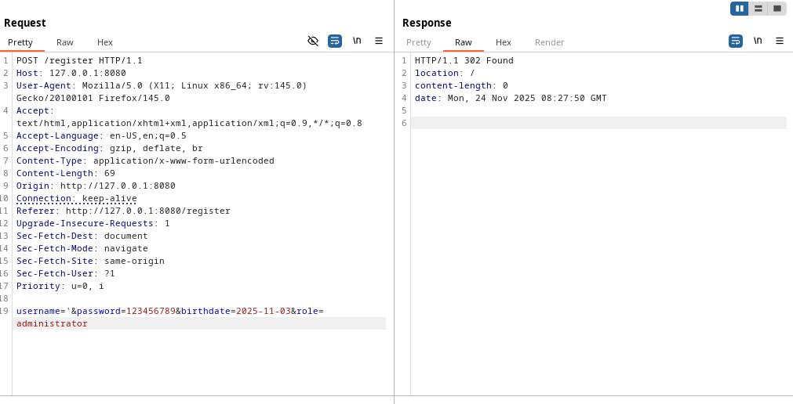
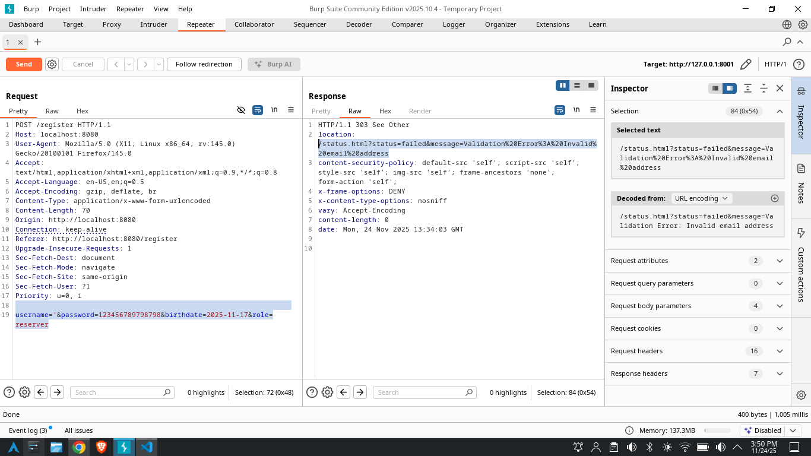
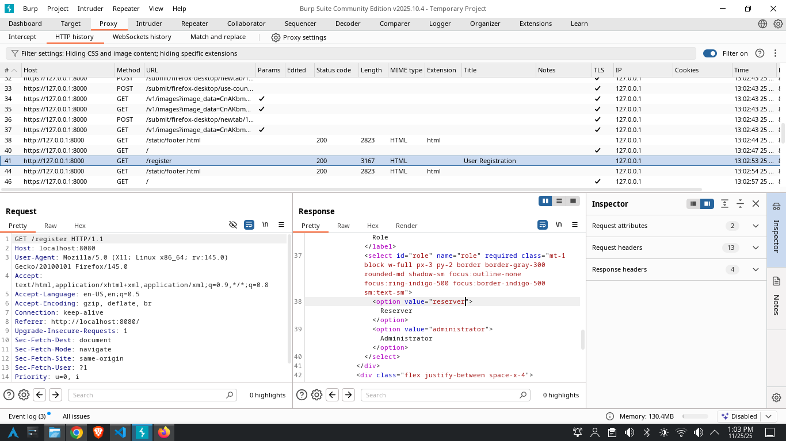
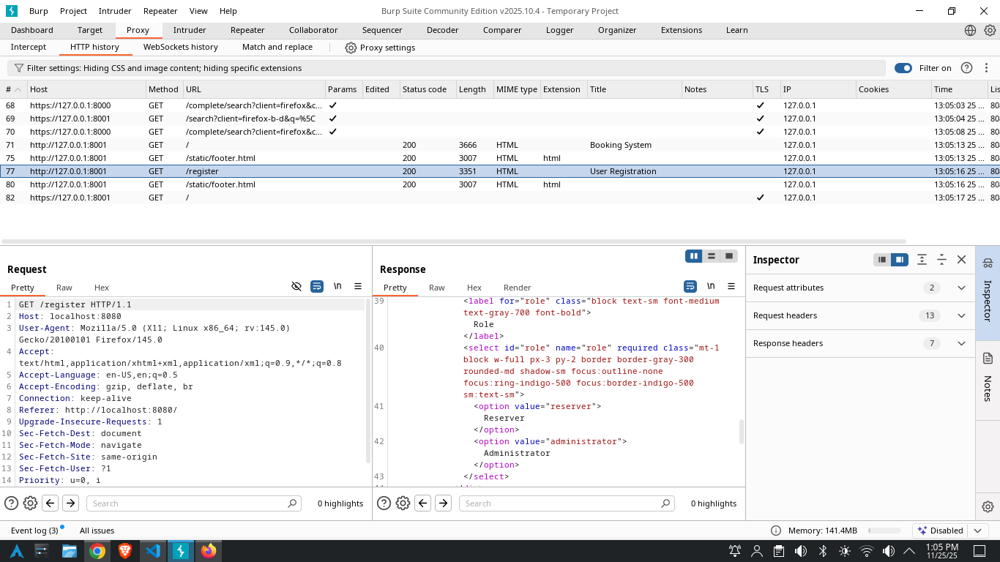
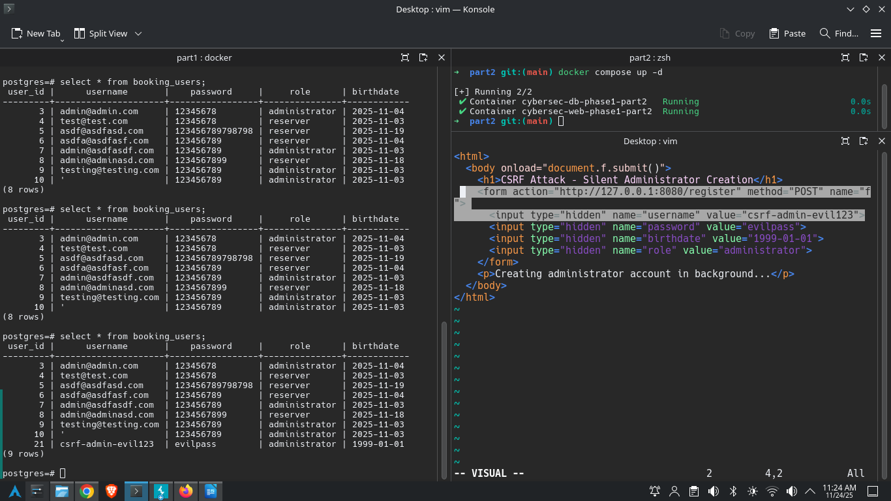
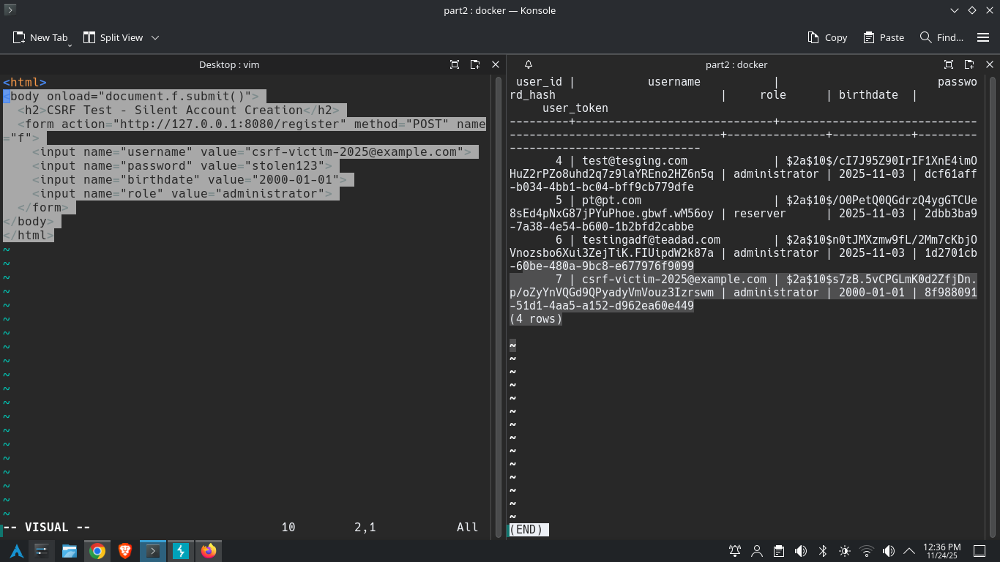
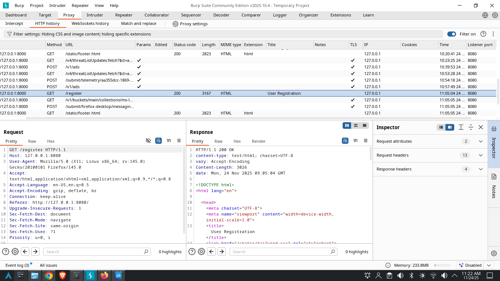
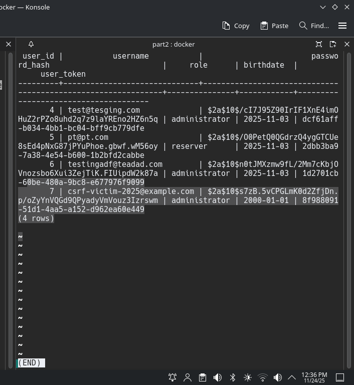

# Discussion Forum Post  
**Title:** Reporting Findings and Fixes  
**Author:** Prahlad Timalsina  
**Date:** 24 November 2025

### Reporting Findings and Fixes – Phase 1 -> Part 2

Hello everyone and the development team,

Below is my official verification report after testing the updated application (Phase 2) from the GitHub Part 2 folder.

I re-tested **exactly the same Top 5 immediate actions** that I reported in Phase 1 -> Part 1 and documented for each one:
- how I originally found it,
- how I verified the fix status in Phase 1 -> part 2,
- the exact steps I performed,
- the current status (Fixed / Not Fixed),
- attached screenshots.

### Top 5 Immediate Actions from Phase 1 and Their Current Status

| # | Phase 1 Finding (Top 5)                                      | Status in Phase 2 | Verdict       |
|---|--------------------------------------------------------------|-------------------|---------------|
| 1 | SQL Injection allowing stacked queries → admin creation     | Gone              | FIXED         |
| 2 | Unrestricted Administrator Registration (role dropdown)     | Still present     | NOT FIXED     |
| 3 | Missing Anti-CSRF Tokens → silent admin creation             | Still missing     | NOT FIXED     |
| 4 | Missing Security Headers (CSP, X-Frame-Options, nosniff)     | All added         | FIXED         |
| 5 | Plain-text password storage & transmission                   | Storage fixed     | FIXED (storage) / PARTIAL (still HTTP) |

### Detailed Verification of Each Finding

In Phase 1-> part 1, the registration endpoint was vulnerable to stacked-query SQL injection. By submitting the payload
`username='&password=any&birthdate=any&role=administrator`
the application executed the injected second query and instantly created a fully privileged administrator account.

In Phase1 -> part 2, I repeated the exact same attack using Burp Repeater. Instead of executing the malicious query, the application now correctly identifies that the username field does not contain a valid email address. 

**It returns:**

``
HTTP/1.1 303 See Other
location: /status.html?status=failed&message=Validation%20Error%3A%20Invalid%20email%20address
content-security-policy: default-src 'self'; script-src 'self'; style-src 'self'; img-src 'self'; frame-ancestors 'none'; form-action 'self';
x-frame-options: DENY
x-content-type-options: nosniff
``
- **Result:** FIXED (prepared statements implemented)

**Finding 2 – Unrestricted Administrator Registration (originally Critical)**  
- **Phase 1 -> Part 1 discovery:** `<select name="role">` in registration form allowed choosing “Administrator”.  

- **Phase 1 -> Part 2 verification steps:**  
  1. Inspected GET /register HTML in Burp → role dropdown still present  
  2. Registered normally and selected “Administrator”  
  3. Logged in → full admin panel access  

- **Result:** NOT FIXED – still anyone can become admin  
- **Evidence:** :- 

**Finding 3 – Missing Anti-CSRF Tokens (originally Medium → Critical when combined with #2)**  
- **Phase 1 -> Part 1 discovery:** No token in form + POC HTML silently created admin accounts. 
  
- **Phase 1 -> Part 2 verification steps:**  
  1. Checked form HTML → no hidden CSRF field  
  2. Opened the same POC HTML file (auto-submit)  
  3. New admin account created without any interaction  
  
-144. ZAP Round 2 still flags this as the only remaining alert  
- **Result:** NOT FIXED  

**Finding 4 – Missing Security Headers (originally Medium)**  
- **Phase 1 -> Part 1 discovery:** CSP, X-Frame-Options, X-Content-Type-Options completely absent.  
  
- **Phase 2 -> part 2 verification steps:**  
  1. Intercepted GET /register in Burp  
  2. Response now contains all three headers correctly  
  
- **Result:** FIXED  

**Finding 5 – Plain-text Password Storage & Transmission (originally Critical)**  
- **Phase 1 discovery:** Passwords visible in Burp + stored clear-text in database.  

- **Phase 2 verification steps:**  
  1. Registered new user → password no longer visible in plain text in DB  
  2. dashboard now shows hashed passwords only  
  3. Still sent over HTTP (no TLS)  
  
- **Result:** Storage = FIXED | Transmission = still over HTTP (partial)  

