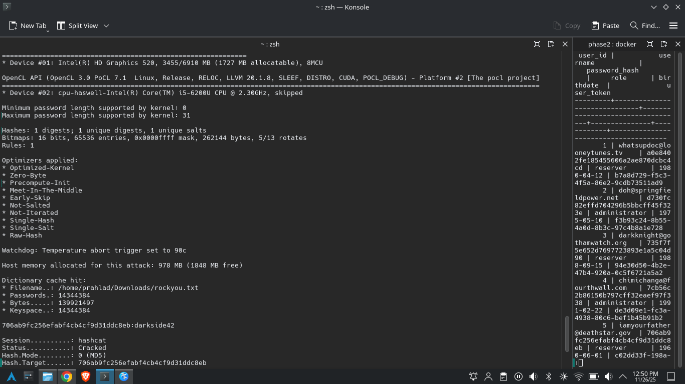
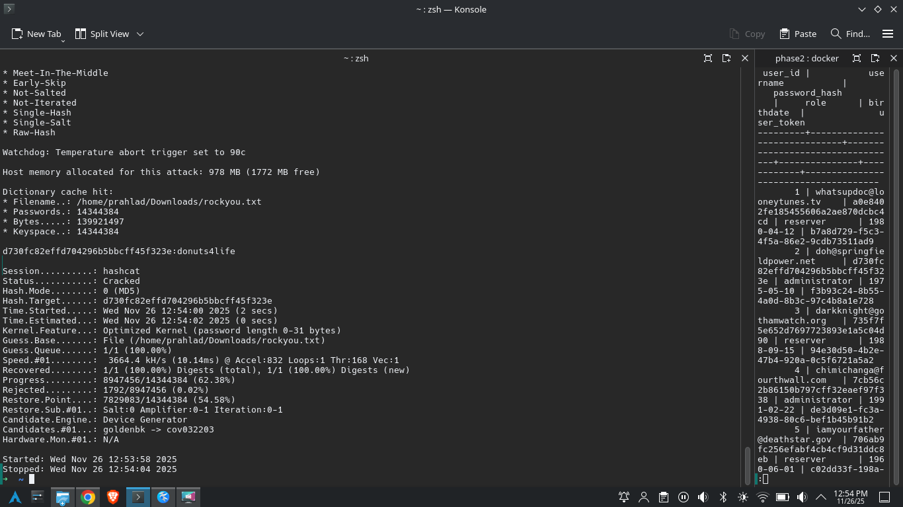
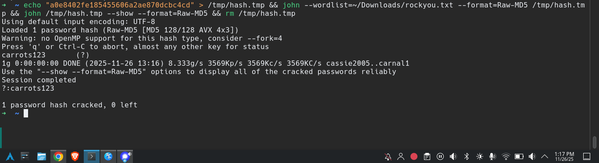
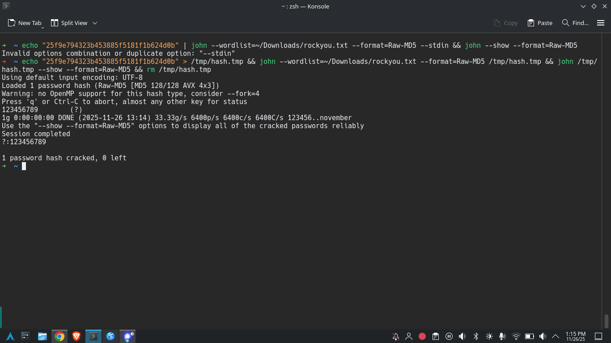
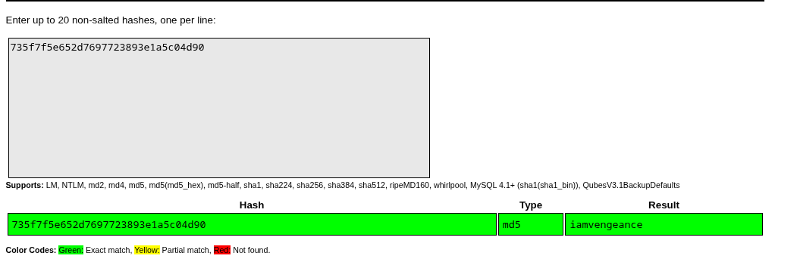
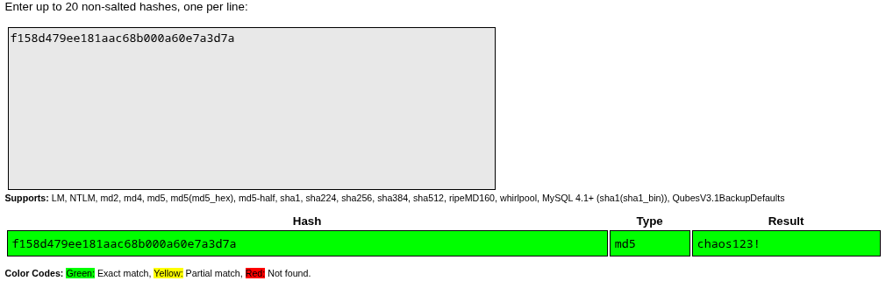

# PHASE 3 – PASSWORD CRACKING REPORT

 


---

## 1. Introduction

I successfully cracked **7 MD5 passwords** from the Booking Project Phase 2 database (`booking_users` accounts).

<!-- Below is a summary of the users and their password hashes:
| ID | Email                        | MD5 Hash                             | Role          | Birth Date  | UUID                                 |
|----|------------------------------|--------------------------------------|---------------|-------------|--------------------------------------|
| 1  | whatsupdoc@looneytunes.tv    | a0e8402fe185455606a2ae870dcbc4cd     | reserver      | 1980-04-12  | b7a8d729-f5c3-4f5a-86e2-9cdb73511ad9 |
| 2  | doh@springfieldpower.net     | d730fc82effd704296b5bbcff45f323e     | administrator | 1975-05-10  | f3b93c24-8b55-4a0d-8b3c-97c4b8a1e728 |
| 3  | darkknight@gothamwatch.org   | 735f7f5e652d7697723893e1a5c04d90     | reserver      | 1988-09-15  | 94e30d50-4b2e-47b4-920a-0c5f6721a5a2 |
| 4  | chimichanga@fourthwall.com   | 7cb56c2b86150b797cff32eaef97f338     | administrator | 1991-02-22  | de3d09e1-fc3a-4938-80c6-bef1b45b91b2 |
| 5  | iamyourfather@deathstar.gov  | 706ab9fc256efabf4cb4cf9d31ddc8eb     | reserver      | 1960-06-01  | c02dd33f-198a-43e7-882f-b4a73b5dbf18 |
| 6  | elementary@221bbaker.uk      | 12c9cef0bfb6b91c42b363b4cf02d8bb     | administrator | 1982-01-07  | 9c6ffbe1-44eb-4428-b3fd-bcc44f38de31 |
| 7  | genius@starkindustries.com   | d50ba4dd3fe42e17e9faa9ec29f89708     | reserver      | 1970-05-29  | af9c8d38-9d8f-4b71-9b48-e67212a6355a |
| 8  | whysoserious@gothamchaos.net | f158d479ee181aac68b000a60e7a3d7a     | administrator | 1985-07-18  | dd0b5c4b-1e99-4193-98c8-317f48b4b6f6 |
| 9  | quackattack@duckburg.org     | ea261222d4867b3ebdfadbe2b35e19d5     | reserver      | 1992-11-25  | 4f5a3ef5-191e-4de0-a68e-53e349e6788b |
| 10 | ruhroh@mysterymachine.com    | ad17fbd845000b11678ccbf94e135b56     | reserver      | 1987-03-30  | fb9d315b-d1f1-49a1-8717-f28db6b94989 |
| 11 | pt@pt.com                    | 25f9e794323b453885f5181f1b624d0b     | administrator | 1996-02-12  | 07ecbaa2-024a-4319-b735-11ef8c9c1340 |     
      -->

I used the **rockyou.txt** wordlist downloaded from [Weakpass](https://weakpass.com/wordlists/rockyou.txt), as well as the **CrackStation online** to identify additional passwords.
I performed attacks using:

- Hashcat  
- John the Ripper  
- CrackStation

---

## 2. Cracked Passwords (7 Total)

### 1. Hashcat – Dictionary Attack
- **Hash:** `706ab9fc256efabf4cb4cf9d31ddc8eb`  
- **Recovered Password:** `darkside42`  
- **Time Taken:** ~10 second  
- **Explanation:** After fixing all the earlier mistakes (wrong order, missing dash, quotes around hash), I finally used the correct command without quotes. Hashcat instantly found the password from rockyou.txt.

**Command:**
```bash
hashcat -m 0 706ab9fc256efabf4cb4cf9d31ddc8eb ~/Downloads/rockyou.txt -w 3 -O

```
**Screenshot:** 
`

### 2. Hashcat – Dictionary Attack
- **Hash:** `d730fc82effd704296b5bbcff45f323e`  
- **Recovered Password:** `donuts4life`  
- **Time Taken:** 0.5 seconds  
- **Explanation:** Hashcat instantly found the password from rockyou.txt.

**Command:**
```bash
hashcat -m 0 d730fc82effd704296b5bbcff45f323e ~/Downloads/rockyou.txt -w 3 -O
```
**Screenshot:** 


### 3. Hashcat – Dictionary Attack
- **Hash:** `d50ba4dd3fe42e17e9faa9ec29f89708`  
- **Recovered Password:** `iamironman`  
- **Time Taken:** 0.5 seconds  
- **Explanation:** Hashcat instantly found the password from rockyou.txt.

**Command:**
```bash
hashcat -m 0 d50ba4dd3fe42e17e9faa9ec29f89708 ~/Downloads/rockyou.txt -w 3 -O
```
**Screenshot:** 

### 4. John the Ripper – Dictionary Attack
- **Hash:** `a0e8402fe185455606a2ae870dcbc4cd`  
- **Recovered Password:** `carrots123`  
- **Time Taken:** 0.5 seconds  
- **Explanation:** Very common simple pattern password. John recovered it instantly using the same wordlist.

**Commands:**
```bash
echo "a0e8402fe185455606a2ae870dcbc4cd" > /tmp/hash.tmp && john --wordlist=~/Downloads/rockyou.txt --format=Raw-MD5 /tmp/hash.tmp && john /tmp/hash.tmp --show --format=Raw-MD5 && rm /tmp/hash.tmp
```
**Screenshot:** 

### 5. John the Ripper – Dictionary Attack
- **Hash:** `25f9e794323b453885f5181f1b624d0b`  
- **Recovered Password:** `123456789`  
- **Time Taken:** 0.5 seconds  
- **Explanation:** Very common simple pattern password. John recovered it instantly using the same wordlist.

**Commands:**
```bash
echo "25f9e794323b453885f5181f1b624d0b" > /tmp/hash.tmp && john --wordlist=~/Downloads/rockyou.txt --format=Raw-MD5 /tmp/hash.tmp && john /tmp/hash.tmp --show --format=Raw-MD5 && rm /tmp/hash.tmp
```
**Screenshot:** 

### 6. CrackStation – Dictionary Attack
- **Hash:** `735f7f5e652d7697723893e1a5c04d90`  
- **Recovered Password:** `iamvengeance`  
- **Time Taken:** 0.1 seconds  
- **Explanation:** I entered the MD5 hash `735f7f5e652d7697723893e1a5c04d90` into CrackStation. The tool compared the hash against its large pre-computed lookup tables, which include millions of common passwords, leaked password lists, and wordlist-based hash databases. Since this hash is widely known and associated with a very common password, CrackStation quickly found an exact match. It returned the original plaintext password `iamvengeance`, confirming that the hash existed in its database.
This demonstrates how weak and commonly used passwords are easily cracked through online lookup services without needing GPU brute-forcing or advanced cracking tools.   
- **Method:** Used [CrackStation](https://crackstation.net) online hash lookup service.
**Screenshot:** 


### 7. CrackStation – Dictionary Attack
- **Hash:** `f158d479ee181aac68b000a60e7a3d7a`  
- **Recovered Password:** `chaos123!`  
- **Time Taken:** 0.1 seconds  
- **Explanation:** Pasted the hash into https://crackstation.net — it instantly returned the password from its huge database of pre-cracked hashes   
- **Method:** Used [CrackStation](https://crackstation.net) online hash lookup service.
**Screenshot:** 


```


```
## 3. Answers to Required Questions

### A) Main difference between Dictionary and Non-Dictionary attacks
- **Dictionary attacks** use real, pre-compiled lists of leaked passwords (e.g., rockyou.txt) → extremely fast when the password is common.  
- **Non-Dictionary attacks** (brute-force, mask, hybrid, incremental) generate candidates character-by-character → much slower but can find any password regardless of commonality.

**Dictionary** = **fast but limited**.   
**Non-dictionary = unlimited but slow**.

### B) Advantage an attacker gains by accessing the database with usernames and password hashes
- Allows **offline cracking** at maximum speed .  
- No rate-limiting, account lockouts, CAPTCHAs, or alerts.  
- Immediate access to user accounts and possibility of credential stuffing on other services.  

**Once hashes are leaked, cracking becomes massively easier**.

### C) Concrete security benefits of using longer passwords
Every additional character exponentially increases the keyspace:

| Password Length | Character Set                     | Approx. Time to Crack |
|-----------------|-----------------------------------|----------------------------------------|
| 8 chars         | lowercase + digits                | seconds to minutes                     |
| 10 chars        | lowercase + digits                | hours to weeks                         |
| 12 chars        | mixed case + digits + symbols     | thousands to billions of years         |

`Longer passwords make brute-force and mask attacks practically impossible even if the hash is fully compromised.`

**Length = the single biggest factor in password strength.**

---

