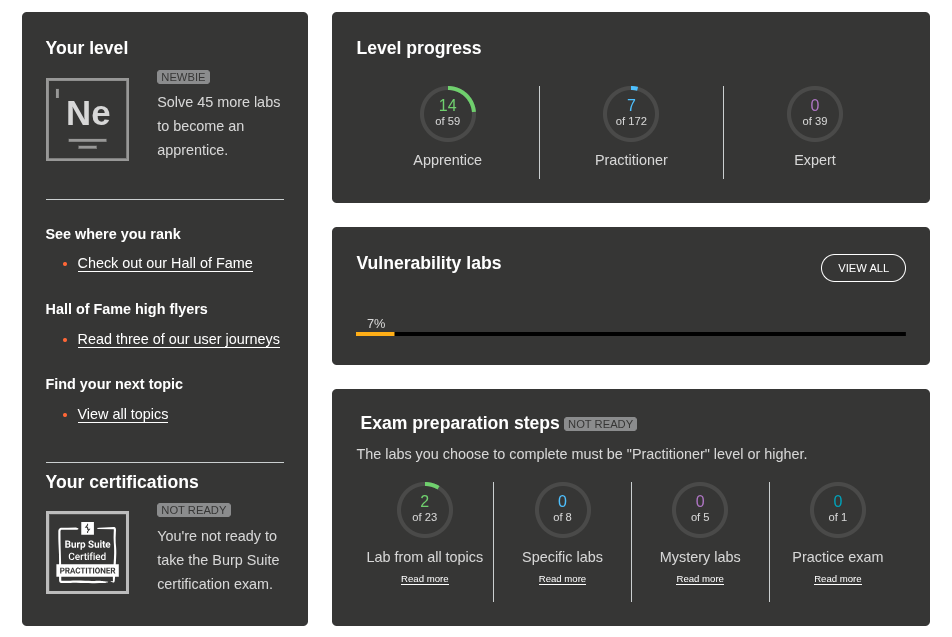

# PortSwigger

- I have successfully completed 21 labs in total. A screenshot of the PortSwigger dashboard shows my completion.

**Evidence of completion:**  

**Mandatory Completed labs (6):**

## Topic SQL injection 

### Lab: Sql injection vulnerability in WHERE clause allowing retrieval of hidden data

- I completed the lab by injecting the category filter to show unreleased products: I closed the category string, added OR 1=1 so the condition always passed, and used a comment to ignore the rest of the WHERE clause. I learned that SQL injection often targets string-built WHERE clauses and can easily bypass business rules. The hardest part was trying different payloads until one matched the app’s SQL syntax. The lab highlighted the importance of prepared statements, allowlists, and input validation.

### Lab: SQL injection vulnerability allowing login bypass

- I solved the login-bypass lab by entering administrator'-- in the username field. The application checks credentials by building a SQL query from the login inputs; my payload closed the username string and turned the rest of the WHERE clause into a comment, so the password check was ignored and I gained administrator access. I learned how fragile authentication is when SQL is built from raw input. The trickiest part was discovering which characters the form accepted. Simple fixes are parameterized/prepared statements and server-side input validation.

## Topic Authentication

### Lab: Username enumeration via different responses

- I completed the username-enumeration lab using Burp Suite. First I sent many usernames to the login endpoint and watched differences in server responses — a different response length/error told me which username was valid. With the username confirmed, I used Burp Intruder to brute-force the password list and spotted the successful attempt by a shorter response length, which revealed the password. I learned how easy it is to discover accounts from inconsistent responses. Mitigations are simple: return uniform error messages, add rate limiting/account lockouts, require CAPTCHAs for repeated attempts, and log/monitor suspicious activity.

### Lab: Password reset broken logic 

- I exploited a flaw in the password reset flow by changing the user parameter and requesting a token for my account. I then modified the token to x and submitted it with the target username carlos, which allowed me to set a new password for Carlos and log in. I learned tokens must be tied to and validated for a specific user. Fixes: use secure, server-stored single-use tokens, validate user-token binding, and avoid trusting client-supplied identifiers.

## Topic Access control

### Lab: Unprotected admin functionality

- I discovered and exploited an unprotected admin panel that allowed deletion of users. By changing the URL trying endings like admin-panel, admin, or administrator. I was able to locate the administrator interface. Because access relied only on obscurity (hoping users wouldn’t try URL tampering), the panel was reachable simply by modifying the URL to administrator-panel. Once inside, I could use the admin functions to remove user accounts.

### Lab: User role modifiable in profile

- In this lab I discovered a vulnerability that let the client change their own roleid value. The app determined access rights at login but stored that role info on the client side and trusted it. By changing roleid from the default 1 to 2, I gained administrator privileges. The root cause was broken access control: never rely on client-side values for security  enforce roles and permissions on the server.

---

***Extra portswigger Completed labs (15):***

### Topic SQL injection 

###  Lab: ->SQL injection attack, querying the database type and version on Oracle

- I completed the lab by exploiting a SQL injection vulnerability to retrieve the database version. By injecting a UNION SELECT payload ('+UNION+SELECT+BANNER,+NULL+FROM+v$version--) into the vulnerable parameter, I was able to extract the version information from the Oracle database. The payload used was designed to match the number of columns in the original query, allowing me to successfully combine results. I learned that understanding the database structure and syntax is crucial for effective SQL injection attacks. The challenge was crafting the correct payload to avoid syntax errors. To prevent such vulnerabilities, developers should use prepared statements, parameterized queries, and input validation.

### Lab: ->SQL injection attack, querying the database type and version on MySQL and Microsoft

- In this lab I learned how SQL injection can be used not only to bypass filters, but also to extract database information. I intercepted the product category request using Burp Suite and modified the parameter to inject a UNION SELECT query. First, I tested how many columns the original query returned and identified which columns accepted text values. After confirming that two text columns were present, I used a UNION-based payload to retrieve the database version. This showed how attackers can identify the database type and version when input is not properly handled. The challenge was ensuring the payload matched the original query structure. To mitigate such attacks, developers should implement prepared statements, use parameterized queries, and validate all user inputs.

## Topic Path traversal

###  Lab: File path traversal, simple case

- In this lab I learned how a file path traversal vulnerability can allow access to sensitive files on the server. I used Burp Suite to intercept the request that loads a product image and modified the filename parameter. By changing the value to `../../../etc/passwd`, the application accessed a file outside the intended directory and returned its contents. This demonstrated how failing to validate file paths can expose critical system files. The lab highlighted the importance of proper input validation and restricting file access on the server are parameterized/prepared statements and server-side input validation.

### Lab: File path traversal, traversal sequences blocked with absolute path bypass

- In this lab I learned that even when directory traversal sequences are blocked, an application can still be vulnerable if absolute paths are not restricted. I used Burp Suite to intercept the request that retrieves a product image and modified the filename parameter to /etc/passwd. The server accepted the absolute path and returned the contents of the file. This showed that filtering only traversal patterns is not enough; applications must strictly control allowed file paths and access locations.

### Lab:File path traversal, traversal sequences stripped non-recursively

- In this lab I learned that simply stripping traversal sequences is not enough to prevent path traversal attacks. I used Burp Suite to intercept the request that loads a product image and modified the filename parameter. By using a crafted path with repeated patterns (....//....//....//etc/passwd), the application still resolved the path and returned the contents of the /etc/passwd file. This demonstrated how weak input sanitization can be bypassed and why proper path normalization and allowlists are required.

### Lab: File path traversal, traversal sequences stripped with superfluous URL-decode

- In this lab I learned that weak filtering combined with multiple URL-decoding steps can still allow path traversal. I intercepted the request for a product image using Burp Suite and modified the filename parameter. By encoding the traversal characters multiple times (..%252f..%252f..%252fetc/passwd), the application decoded the input again on the server side and resolved the path. As a result, it returned the contents of the /etc/passwd file. This showed why proper normalization and strict allowlists are essential.

### Lab: File path traversal, validation of start of path

- In this lab I learned that checking only the beginning of a file path is not sufficient to prevent path traversal attacks. I used Burp Suite to intercept the request that retrieves a product image and modified the filename parameter to start with a valid directory path followed by traversal sequences. Even though the path began with /var/www/images/, the application resolved the ../ segments and accessed a sensitive system file. As a result, the contents of /etc/passwd were returned. This highlighted the need for proper path normalization and strict server-side file access controls.

### Lab: File path traversal, validation of file extension with null byte bypass

- In this lab I learned that validating only the file extension does not fully protect against path traversal. I intercepted the request for a product image using Burp Suite and modified the filename parameter. By appending a null byte followed by a valid image extension (../../../etc/passwd%00.png), the application passed the extension check but treated the path as the system file. As a result, it returned the contents of /etc/passwd. This showed why applications must properly handle null bytes and enforce strict server-side path validation.

### Extra Topic Access control labs

### Lab:Unprotected admin functionality with unpredictable URL 

- In this lab I learned that hiding an admin panel behind an unpredictable URL does not provide real security. By reviewing the page source using Burp Suite or the browser’s developer tools, I found JavaScript code that revealed the admin panel URL. I then accessed the admin interface directly and used the available functionality to delete the user carlos. This demonstrated that security through obscurity is ineffective and that admin features must always be protected with proper authentication and authorization checks.

### Lab:User role controlled by request parameter

- In this lab I first logged in using the provided credentials wiener:peter. Initially, I could not access the admin panel at /admin. I then intercepted the login response using Burp Suite and observed that the application set a cookie with Admin=false. By changing this value to Admin=true, the application trusted the modified parameter and granted me administrative access. After that, I was able to load the admin panel and delete the user carlos. This lab showed why user roles must always be validated server-side and never controlled by client-side parameters.

### Lab:User ID controlled by request parameter 

- In this lab I logged in using the provided credentials wiener:peter and navigated to my account page. I observed that the page URL contained my username in the id parameter. I sent this request to Burp Repeater and modified the id value from my username to carlos. The application accepted the changed parameter and returned Carlos’s account information, including his API key. This demonstrated an insecure direct object reference (IDOR) issue, where user access is controlled by client-supplied parameters instead of proper server-side authorization checks.

### Lab:User ID controlled by request parameter, with unpredictable user IDs 

- In this lab I learned that even when user IDs are not easily guessable, access control can still be broken. I first found a blog post written by carlos and clicked on his name to identify his user ID from the URL. After logging in with the provided credentials and opening my own account page, I replaced my user ID in the id parameter with Carlos’s ID. The application accepted the change and displayed Carlos’s account details, allowing me to retrieve and submit his API key. This demonstrated that relying on unpredictable IDs is not sufficient for access control; proper server-side authorization checks are essential to ensure users can only access their own data.

### Lab:Reflected XSS into HTML context with nothing encoded

- In this lab I learned how reflected XSS vulnerabilities can be exploited when user input is not properly sanitized. I used Burp Suite to intercept a search request and modified the search parameter to include a script tag: ``. When I submitted the request, the application reflected my input directly into the HTML response without encoding it, causing the script to execute in my browser. This demonstrated the importance of output encoding and input validation to prevent XSS attacks.

### Lab: Stored XSS into HTML context with nothing encoded

- In this lab I learned how stored XSS vulnerabilities can lead to persistent attacks when user input is saved and later rendered without proper sanitization. I used the comment form on a blog post to submit a comment containing a script tag: ``. When I or any other user viewed the blog post, the application rendered my comment directly into the HTML response without encoding it, causing the script to execute in the browser. This highlighted the need for output encoding and input validation to prevent stored XSS attacks.

### Lab: DOM XSS in document.write sink using source location.search

- In this lab I learned how DOM-based XSS vulnerabilities can occur when user input is directly manipulated in the browser without proper sanitization. I entered a crafted payload into the search box that broke out of the img src attribute and injected a script: `"><svg onload=alert(1)>`. When the page loaded, the script executed in my browser, demonstrating a DOM XSS attack. This highlighted the importance of sanitizing and validating user input before using it in client-side scripts or HTML contexts.

---

# The Booking System Project

## Phase 1 – Part 1: Registration and Authentication Security Testing

**What I did:**  
- I focused on penetration testing the Booking System’s registration and authentication flows. I used grey-box approach with Docker Compose, I tested the `/register` page, client-side validation, HTTP requests, cookie and session management. I used tools like OWASP ZAP, Burp Suite, and browser developer tools to identify security issues.

**What worked:**  
- The testing approach and tools, which helped me quickly find serious vulnerabilities like SQL injection and missing CSRF protection.

**What didn’t work:**  
- The system’s security controls. Client-side validation could be bypassed, role selection was unrestricted, and passwords were handled insecurely.

**What took the most time:**  
- Analyzing HTTP traffic and confirming vulnerabilities like SQL injection and CSRF.

**What I learned:**  
- I learned that client-side validation is not enough and that server-side validation, CSRF protection, and secure authentication mechanisms are essential.

---

## Phase 1 – Part 2: Vulnerability Review and Remediation Status

**What I did:**  
- In this phase, I reviewed the critical vulnerabilities found earlier and checked which ones were fixed in the next version of the system. I verified SQL injection fixes, security headers, and password handling improvements.

**What worked:**  
- SQL injection fixed with prepared statements
- Security headers added
- Password storage improved via hashing

**What didn’t work:**  
- Unrestricted admin registration still present
- Anti-CSRF tokens missing
- Passwords transmitted over HTTP

**What took the most time:**  
- Verifying fixes and testing whether vulnerabilities were truly resolved took the most time.

**What I learned:**  
- I learned that fixing only some vulnerabilities is not enough, and unresolved issues can still leave the system insecure.

---

## Phase 2 – Password Cracking and Credential Security Assessment

**What I did:**  
- In this phase, I tested the strength of stored passwords by cracking MD5 hashes from the database. I used Hashcat, John the Ripper, and the CrackStation online service with common wordlists.

**What worked:**  
- Dictionary attacks successfully recovered multiple passwords.
- CrackStation quickly identified common passwords.

**What didn’t work:**  
- MD5 hashing offered no resistance; no salting or key stretching.

**What took the most time:**  
- Configuring tools correctly and validating recovered passwords.

**What I learned:**  
- Weak hashing and common passwords are easily compromised; strong hashing and password policies are essential.

---

## Phase 3 – Authorization and Access Control Testing

**What I did:**  
- In this phase, I tested what Guest, Reserver, and Administrator users could and could not do. I used browser testing and direct API requests and performed endpoint discovery using Gobuster and FFUF.

**What worked:**  
- Admin users had full control
- Some unauthorized actions blocked via redirects

**What didn’t work:**  
- `/api/users` accessible without authentication
- Reservers could modify other users’ reservations
- Inconsistent authorization checks

**What took the most time:**  
- Manually testing different roles and verifying API behavior took the most time.

**What I learned:**  
- I learned that authentication alone is not enough and that strong authorization and ownership checks are required.

---

## Phase 4 – GDPR Compliance, Cookie Policy, Terms of Service, and Privacy Policy

**What I did:**  
- Assessed GDPR compliance, visibility of reservations, user rights, internal documentation, and homepage links to Cookie Policy, Terms of Service, and Privacy Policy.

**What worked:**  
- Registration included consent and ToS acceptance
- Policies accessible from homepage

**What didn’t work:**  
- Public APIs exposed sensitive data → GDPR violation
- Users could not edit or delete personal data
- Weak authorization allowed reservation modification
- No internal documentation or breach notification

**What took the most time:**  
- Mapping personal data and checking API exposure took the most time.

**What I learned:**  
- Data minimization, access control, and enforcing user rights are essential for GDPR compliance.

---

# Logbook

**Git repository:**  
`https://github.com/prahladtimalsina/Cybersecurity-And-Data-Privacy-Autumn2025`

## Time Summary

### Total Hours
- **Total hours spent on the course:** 80 hours

### Hours per Topic
- Kick-off lecture & Cisco chapters: **10 hours**
- PortSwigger labs (mandatory): **12 hours**
- PortSwigger labs (extra – 15 labs): **15 hours**
- Booking System project (setup, phases 1–4, testing): **30 hours**
- Authorization & GDPR tasks: **11 hours**
- Final assignment preparation: **2 hours**

---

## Reflection (50–100 words)

This cybersecurity course taught me to conduct penetration testing, password security assessments, access control testing, and GDPR compliance evaluations. I learned the importance of secure coding, hashing, authorization checks, data minimization, and privacy policy enforcement.On top of that, I got plenty of hands-on experience tinkering with powerful tools such as Hashcat for cracking hashes, John the Ripper for password recovery simulations, CrackStation for quick lookups, OWASP ZAP and Burp Suite for intercepting and analyzing web traffic, plus Gobuster and FFUF for directory enumeration and fuzzing attacks all of which seriously boosted my practical expertise in web applications security. Each phase emphasized the need for continuous testing and validation to protect users data and ensure secure system behavior.

---

## Feedback (Optional)

The course was very informative and provided excellent hands-on experience. I appreciated the practical labs and real-world scenarios, which helped solidify my understanding of cybersecurity principles. 
No major improvements were suggested, but minor recommendations include writing assignment reflections immediately after completion (to attach to the final report)
Overall, the learning experience was highly beneficial and enhanced my skills in web application security, penetration testing, and data privacy compliance.
